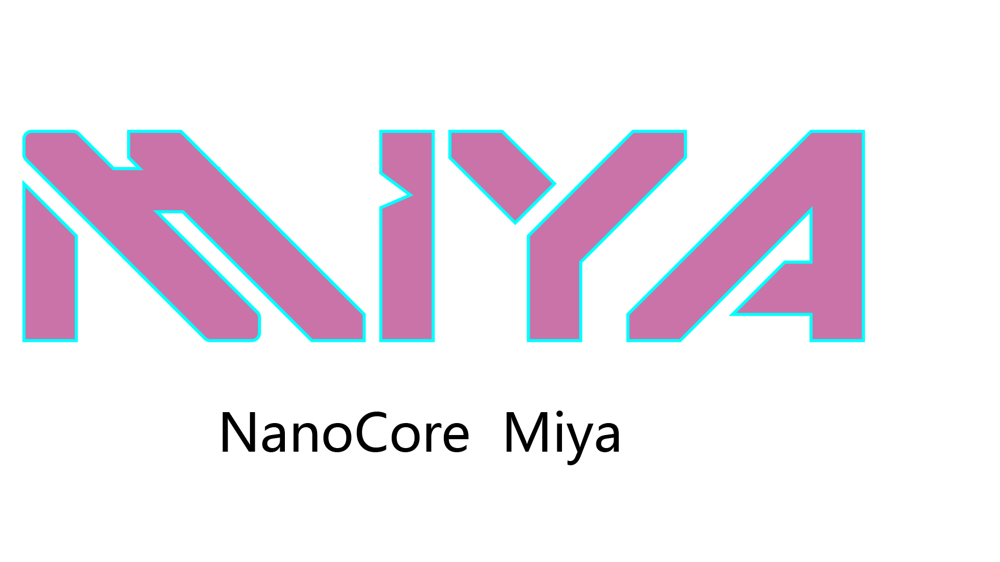
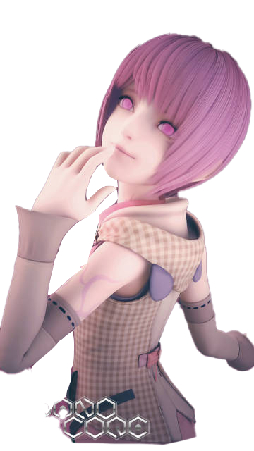
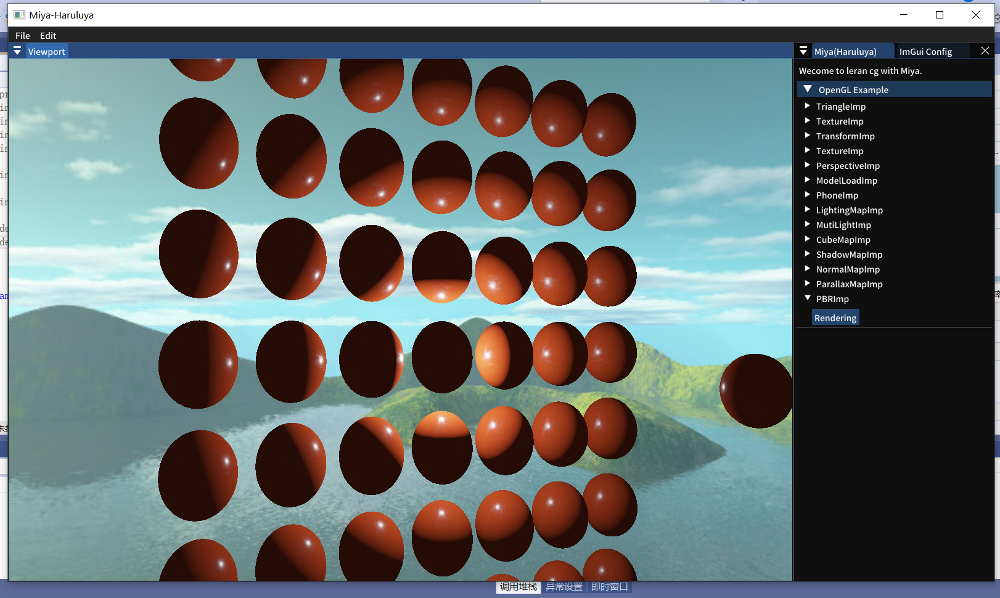

## Miya
A project includes rendering demos and some Complex technology implementations based on OpenGL.


### Introduction




### Name

**Miya**

One of the main characters in the "NanoCore".



### Usage

```shell
git clone https://github.com/Haruluya/Miya.git
```

### Presentation

###### 


### Contact Author 

### License

MIT


